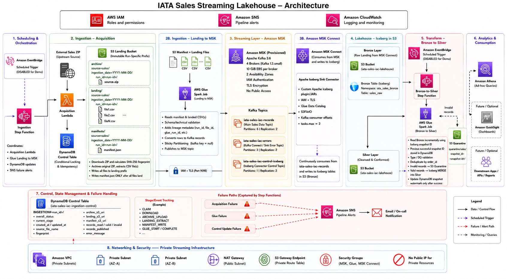

# IATA Sales Streaming Lakehouse — AWS Data Engineering Case Study

> End-to-end AWS data engineering pipeline demonstrating batch acquisition, Kafka streaming with Amazon MSK, Apache Iceberg Bronze/Silver lakehouse design, AWS Glue/Spark processing, Step Functions orchestration, Athena serving, CloudWatch observability, and CloudFormation Infrastructure as Code.

## 1. Problem statement

The source is a large external ZIP containing approximately two million sales records. The target solution must:

1. acquire the external file and archive the original compressed source;
2. extract and land the raw CSV data in Amazon S3;
3. stream individual records through Kafka;
4. materialize the stream into a Bronze Apache Iceberg table on S3;
5. transform Bronze into a typed, deduplicated Silver Iceberg table;
6. expose Bronze and Silver through Amazon Athena;
7. provide reproducible Infrastructure as Code, monitoring, failure handling and an operational control trail.

Source dataset:

```text
https://eforexcel.com/wp/wp-content/uploads/2020/09/2m-Sales-Records.zip
```

The implementation intentionally treats **file acquisition as batch** and **record movement into the lakehouse as streaming**.

---

## 2. Architecture



> `EventBridge` is shown in the architecture as the intended production scheduler. It is **not deployed in the demo stack**. For the case-study demonstration, the ingestion Step Function is started manually so each execution is deliberate and easy to observe.

### High-level data flow

```text
External ZIP
    |
    v
Acquisition Lambda
    |---- archive/      original ZIP
    |---- landing/      extracted CSV
    `---- manifests/    READY run manifest
    |
    v
Ingestion Step Function
    |
    v
Glue Spark: Landing -> MSK
    |
    v
Amazon MSK: iata-sales-iac-records
    |
    v
MSK Connect + Apache Iceberg custom plugin
    |
    v
Bronze Iceberg: iata_sales_iac_bronze.sales_raw
    |
    v
Bronze -> Silver Step Function
    |
    v
Glue Spark: validation + typing + dedup + MERGE
    |                         |
    |                         `--> quarantine/
    v
Silver Iceberg: iata_sales_iac_silver.sales
    |
    v
Amazon Athena
```

### Control plane versus data plane

The design deliberately separates orchestration metadata from bulk data:

```text
Control plane
Step Functions + DynamoDB + SNS + CloudWatch

Data plane
S3 + Glue/Spark + Kafka/MSK + Iceberg
```

Step Functions passes small references such as `manifest_uri` and `silver_run_id`; it never transports the multi-million-row dataset itself.

---

## 3. AWS network design

The stack creates a dedicated two-AZ VPC.

| Resource | Value / purpose |
|---|---|
| VPC | `10.20.0.0/16` |
| Public subnet 1 | `10.20.101.0/24`, `ap-southeast-1a` |
| Public subnet 2 | `10.20.102.0/24`, `ap-southeast-1b` |
| Private subnet 1 | `10.20.1.0/24`, `ap-southeast-1a` |
| Private subnet 2 | `10.20.2.0/24`, `ap-southeast-1b` |
| Internet Gateway | Internet path for public subnets |
| NAT Gateway | Outbound internet path for private subnets |
| S3 Gateway Endpoint | Private S3 route from private route tables |
| MSK listener | IAM/TLS on TCP `9098` |

### Routing

Public subnets have:

```text
0.0.0.0/0 -> Internet Gateway
```

Private subnets have:

```text
VPC CIDR      -> local
S3 prefix     -> S3 Gateway Endpoint
0.0.0.0/0    -> NAT Gateway
```

The S3 Gateway Endpoint keeps S3 traffic on the AWS network and avoids routing S3 access through NAT.

### Security groups

Separate security groups are used for workload isolation:

| Source SG | Destination | Port | Purpose |
|---|---|---:|---|
| Glue SG | MSK SG | `9098` | Landing-to-MSK Spark producer |
| MSK Connect SG | MSK SG | `9098` | Iceberg sink Kafka consumer |
| Private workloads | HTTPS endpoints | `443` | AWS service access where required |

Security groups answer **“can the network connection reach the broker?”**. MSK IAM answers **“who is the client and which Kafka operations may it perform?”**. Both must succeed.

The Acquisition Lambda is intentionally not attached to the VPC; it must download the public external source and does not need access to the private Kafka brokers.

---

## 4. Orchestration

Two AWS Step Functions Standard workflows are deployed.

### 4.1 Ingestion workflow

```text
Run Acquisition
      |
      v
Run Landing To MSK (.sync)
      |
      v
Mark Run Completed in DynamoDB
      |
      v
SUCCEED
```

Failure routes persist state and publish SNS notifications.

Important implementation detail:

```text
glue:startJobRun.sync
```

means Step Functions waits for the Glue producer to reach a terminal state before continuing.

The workflow ends at `MSK_PUBLISHED`. MSK Connect -> Bronze is asynchronous, so the workflow does not use an arbitrary fixed wait and claim that Bronze has completed.

### 4.2 Bronze-to-Silver workflow

```text
Create Silver Run ID
      |
      v
Run Bronze To Silver Glue (.sync)
      |
      v
Get Processing Summary from DynamoDB
      |
      v
Choice
  |                 |
  | quarantine=0    | quarantine>0
  v                 v
SUCCESS           DQ warning SNS
                    |
                    v
                  SUCCESS
```

Technical failures fail the state machine. Business data-quality exceptions are quarantined and surfaced as warnings.

---

## 5. DynamoDB control table

Table:

```text
iata-sales-iac-ingestion-control
```

Key design:

```text
pk  STRING   partition key
sk  STRING   sort key
```

Billing is `PAY_PER_REQUEST`, encryption is enabled, and Point-in-Time Recovery is enabled.

The table stores **pipeline control and reconciliation state**, not sales records.

### 5.1 Ingestion run metadata

Example item:

| Attribute | Example |
|---|---|
| `pk` | `RUN#sales-20260727T040000Z-a1b2c3d4` |
| `sk` | `METADATA` |
| `run_id` | `sales-20260727T040000Z-a1b2c3d4` |
| `source_name` | `sales` |
| `dataset_name` | `sales_records` |
| `source_file_name` | `2m-Sales-Records.zip` |
| `source_file_id` | SHA-256 of downloaded ZIP |
| `status` | `COMPLETED` |
| `stage` | `MSK_PUBLISHED` |
| `archive_s3_uri` | `s3://.../archive/...zip` |
| `manifest_s3_uri` | `s3://.../manifests/.../manifest.json` |
| `file_count` | `1` |
| `start_time` | UTC timestamp |
| `end_time` | UTC timestamp |
| `error_message` | populated on failure |

Example JSON:

```json
{
  "pk": "RUN#sales-20260727T040000Z-a1b2c3d4",
  "sk": "METADATA",
  "run_id": "sales-20260727T040000Z-a1b2c3d4",
  "source_name": "sales",
  "dataset_name": "sales_records",
  "source_file_name": "2m-Sales-Records.zip",
  "source_file_id": "7d1f...sha256...",
  "status": "COMPLETED",
  "stage": "MSK_PUBLISHED",
  "file_count": 1,
  "archive_s3_uri": "s3://iata-sales-iac-landing-<ACCOUNT_ID>/archive/...",
  "manifest_s3_uri": "s3://iata-sales-iac-landing-<ACCOUNT_ID>/manifests/.../manifest.json"
}
```

### 5.2 Bronze-to-Silver watermark

One shared item tracks the last successfully processed Bronze Iceberg snapshot:

```json
{
  "pk": "PIPELINE#BRONZE_TO_SILVER",
  "sk": "WATERMARK",
  "last_snapshot_id": 123456789,
  "bronze_records_read": 2000000,
  "valid_records": 1999980,
  "quarantine_records": 10,
  "duplicates_removed": 10,
  "silver_records_processed": 1999970,
  "last_successful_ts": "2026-07-27T04:30:00+00:00"
}
```

### 5.3 Per-Silver-run reconciliation

Each Bronze-to-Silver Step Function execution generates a UUID and Glue writes an execution-specific summary:

```json
{
  "pk": "SILVER_RUN#2f0c6c94-....",
  "sk": "SUMMARY",
  "silver_run_id": "2f0c6c94-....",
  "status": "COMPLETED",
  "load_type": "INCREMENTAL",
  "start_snapshot_id": 123456000,
  "end_snapshot_id": 123456789,
  "bronze_records_read": 10000,
  "valid_records": 9980,
  "quarantine_records": 10,
  "duplicates_removed": 10,
  "silver_records_processed": 9970,
  "completed_at": "2026-07-27T04:30:00+00:00"
}
```

---

## 6. S3 layout

### Landing bucket

```text
s3://iata-sales-iac-landing-<ACCOUNT_ID>/
├── archive/
│   └── source=sales/ingestion_date=YYYY-MM-DD/run_id=<run-id>/
│       └── 2m-Sales-Records.zip
├── landing/
│   └── source=sales/ingestion_date=YYYY-MM-DD/run_id=<run-id>/
│       └── <extracted CSV>
└── manifests/
    └── source=sales/ingestion_date=YYYY-MM-DD/run_id=<run-id>/
        └── manifest.json
```

The manifest is written last and represents a complete acquisition run.

### Lakehouse bucket

```text
s3://iata-sales-iac-lakehouse-<ACCOUNT_ID>/
├── bronze/
│   └── sales_raw/
│       ├── data/
│       └── metadata/
├── silver/
│   └── sales/
│       ├── data/
│       └── metadata/
└── quarantine/
    └── sales/
```

---

## 7. Kafka / Amazon MSK

Main topics:

| Topic | Purpose |
|---|---|
| `iata-sales-iac-records` | Valid sales events produced by Glue |
| `iata-sales-iac-errors` | Connector DLQ / error records |
| `iata-sales-iac-control-iceberg` | Iceberg sink coordination/commit control |

The MSK cluster uses IAM authentication and TLS. The producer sends JSON records and keys records by the configured business key so Kafka partitioning is deterministic for the same key.

### Glue Kafka runtime dependencies

The Landing-to-MSK Glue Spark job uses three tested JARs:

| Dependency | Purpose |
|---|---|
| `spark-sql-kafka-0-10_2.12-3.5.6.jar` | Spark SQL/DataFrame Kafka connector |
| `spark-token-provider-kafka-0-10_2.12-3.5.6.jar` | Spark Kafka token/auth support |
| `aws-msk-iam-auth-2.3.7-all.jar` | AWS MSK IAM SASL authentication |

These JARs are for the **Glue Spark producer**. They are not the MSK Connect Iceberg plugin.

---

## 8. MSK Connect Iceberg sink

Amazon MSK Connect runs the Apache Iceberg Kafka Connect sink in the private VPC.

Core configuration:

```properties
connector.class=org.apache.iceberg.connect.IcebergSinkConnector
tasks.max=2
topics=iata-sales-iac-records

iceberg.tables=iata_sales_iac_bronze.sales_raw
iceberg.tables.auto-create-enabled=false
iceberg.tables.evolve-schema-enabled=false

iceberg.catalog.catalog-impl=org.apache.iceberg.aws.glue.GlueCatalog
iceberg.catalog.io-impl=org.apache.iceberg.aws.s3.S3FileIO
iceberg.catalog.warehouse=s3://iata-sales-iac-lakehouse-<ACCOUNT_ID>/bronze

iceberg.control.topic=iata-sales-iac-control-iceberg
iceberg.control.commit.interval-ms=10000

key.converter=org.apache.kafka.connect.storage.StringConverter
value.converter=org.apache.kafka.connect.json.JsonConverter
value.converter.schemas.enable=false

errors.tolerance=all
errors.deadletterqueue.topic.name=iata-sales-iac-errors
```

The connector uses:

```text
1 provisioned worker x 2 MCU
```

and a dedicated IAM service execution role with Kafka, transactional-ID, S3, Glue Catalog and CloudWatch permissions.

### Custom plugin

CloudFormation registers:

```text
AWS::KafkaConnect::CustomPlugin
```

from a ZIP in the plugins S3 bucket and then references its ARN/revision from:

```text
AWS::KafkaConnect::Connector
```

The complete Iceberg Kafka Connect plugin distribution is a separate binary artifact from the three Glue JARs.

---

## 9. Iceberg data model

The table contracts are explicitly version controlled under:

```text
infra/sql/iceberg/
```

MSK Connect table auto-creation and schema evolution are disabled so the schema is deliberate and reviewable.

### 9.1 Bronze — `iata_sales_iac_bronze.sales_raw`

Bronze preserves the source representation. Business fields remain strings.

| Column | Bronze type | Purpose |
|---|---|---|
| `region` | string | source |
| `country` | string | source |
| `item_type` | string | source |
| `sales_channel` | string | source |
| `order_priority` | string | source |
| `order_date` | string | source |
| `order_id` | string | source |
| `ship_date` | string | source |
| `units_sold` | string | source |
| `unit_price` | string | source |
| `unit_cost` | string | source |
| `total_revenue` | string | source |
| `total_cost` | string | source |
| `total_profit` | string | source |
| `run_id` | string | ingestion lineage |
| `file_id` | string | source-file fingerprint |
| `file_name` | string | lineage |
| `source_file_uri` | string | lineage |
| `source_name` | string | lineage |
| `dataset_name` | string | lineage |
| `manifest_key` | string | lineage |
| `glue_run_id` | string | producer execution |
| `etl_create_ts` | timestamp | Bronze arrival timestamp |

Partition transform:

```text
day(etl_create_ts)
```

Storage:

```text
S3 + Parquet + ZSTD + Iceberg metadata
```

### 9.2 Silver — `iata_sales_iac_silver.sales`

| Column | Silver type |
|---|---|
| `region` | string |
| `country` | string |
| `item_type` | string |
| `sales_channel` | string |
| `order_priority` | string |
| `order_date` | date |
| `order_id` | bigint |
| `ship_date` | date |
| `units_sold` | bigint |
| `unit_price` | decimal(12,2) |
| `unit_cost` | decimal(12,2) |
| `total_revenue` | decimal(18,2) |
| `total_cost` | decimal(18,2) |
| `total_profit` | decimal(18,2) |
| lineage columns | same as Bronze |
| `etl_create_ts` | timestamp |
| `silver_update_ts` | timestamp |

Partition transform:

```text
month(order_date)
```

Silver processing:

1. reads only the required Bronze snapshot range;
2. casts and validates business fields;
3. sends rejected business rows to `quarantine/sales/`;
4. deduplicates by `order_id`, preferring the latest lineage/timestamp;
5. uses Iceberg `MERGE INTO` for deterministic upsert behaviour;
6. advances the DynamoDB watermark only after successful processing.

---

## 10. Infrastructure as Code

`infra/templates/main.yaml` is the parent CloudFormation template. It composes nested templates:

| Template | Responsibility |
|---|---|
| `network.yaml` | VPC, subnets, routes, NAT, endpoint, security groups |
| `storage.yaml` | S3, DynamoDB, Glue databases |
| `iam.yaml` | workload execution roles and policies |
| `messaging.yaml` | SNS, MSK, topics, Schema Registry, MSK Connect |
| `compute.yaml` | Lambda, Glue jobs, Glue Kafka connection |
| `orchestration.yaml` | both Step Functions |
| `monitoring.yaml` | dashboard and alarms |

Deployment is split into two CloudFormation phases because the MSK IAM bootstrap broker endpoints only exist after the cluster has been created.

### Phase 1

Creates the foundation:

```text
network
storage/catalog/control table
IAM
SNS
MSK cluster + topics
Schema Registry
base log groups
```

### Phase 2

After runtime artifacts and tables are ready, creates/enables:

```text
Acquisition Lambda
Glue Kafka connection
Landing -> MSK Glue
Bronze -> Silver Glue
Iceberg Custom Plugin
MSK Connect connector
Step Functions
CloudWatch dashboard / alarms
```

---

## 11. Deployment

### 11.1 Prerequisites

The deployment machine requires:

```text
AWS CLI v2
Python 3
zip
bash
cfn-lint (recommended)
```

The AWS CLI must already be authenticated to the target account.

For a sandbox/case-study account, `AdministratorAccess` is the simplest deployment permission model because the stack creates IAM, VPC, MSK, Glue, Lambda, Step Functions, S3 and related resources. Runtime workloads themselves use dedicated scoped execution roles.

No AWS access key or secret key is stored in this repository.

### 11.2 Create a Python virtual environment

```bash
python3 -m venv .venv
source .venv/bin/activate

python -m pip install --upgrade pip
pip install cfn-lint
```

### 11.3 Configure environment

```bash
export AWS_ACCOUNT_ID="<YOUR_AWS_ACCOUNT_ID>"
export AWS_REGION="ap-southeast-1"
export PROJECT_NAME="iata-sales-iac"
export ALERT_EMAIL="<YOUR_EMAIL>"
```

Verify identity:

```bash
aws sts get-caller-identity
```

### 11.4 Iceberg plugin prerequisite

The full Iceberg Kafka Connect plugin ZIP is intentionally not committed to Git because it is a large binary distribution.

`package.sh` expects either the default local file:

```text
dependencies/msk-connect/iceberg/iceberg-kafka-connect-runtime-1.11.0-SNAPSHOT.zip
```

or an explicit path:

```bash
export PLUGIN_ZIP_PATH="/absolute/path/to/iceberg-kafka-connect-runtime.zip"
```

This variable must be set before running the full wrapper if the default file is not present.

### 11.5 Validate locally

```bash
chmod +x infra/scripts/*.sh
./infra/scripts/validate.sh
```

Validation performs:

```text
Python byte-code compilation
bash syntax checks
JSON parsing
cfn-lint when installed
```

### 11.6 One-command deployment

The preferred entry point is:

```bash
AWS_ACCOUNT_ID="<YOUR_AWS_ACCOUNT_ID>" \
AWS_REGION="ap-southeast-1" \
ALERT_EMAIL="<YOUR_EMAIL>" \
PLUGIN_ZIP_PATH="/absolute/path/to/iceberg-plugin.zip" \
./infra/scripts/deploy-wrapper.sh create
```

The wrapper performs:

```text
1. repository validation
2. bootstrap bucket creation/check
3. package CloudFormation templates
4. Phase 1 deployment
5. package/upload runtime artifacts
6. Phase 2 pre-flight + Iceberg table bootstrap + deployment
7. final verification
```

During Phase 2, `deploy.sh` retrieves the IAM/TLS MSK bootstrap servers dynamically and executes the version-controlled Athena DDLs before the connector is created.

After deployment, confirm the SNS email subscription from the AWS confirmation email.

### 11.7 Manual deployment sequence

For debugging or demonstration:

```bash
./infra/scripts/validate.sh
./infra/scripts/package.sh
./infra/scripts/deploy.sh phase1

./infra/scripts/package.sh
./infra/scripts/deploy.sh phase2
```

`phase2` retrieves the MSK IAM bootstrap brokers if they are not supplied explicitly.

---

## 12. Run the demo

### 12.1 Start ingestion

Obtain the state machine ARN:

```bash
INGESTION_ARN="$(aws cloudformation describe-stacks \
  --stack-name iata-sales-iac \
  --region "${AWS_REGION}" \
  --query "Stacks[0].Outputs[?OutputKey=='IngestionStateMachineArn'].OutputValue | [0]" \
  --output text)"
```

Run:

```bash
aws stepfunctions start-execution \
  --state-machine-arn "${INGESTION_ARN}" \
  --input '{}' \
  --region "${AWS_REGION}"
```

Expected flow:

```text
Lambda acquisition
-> S3 archive/landing/manifest
-> Glue Landing-to-MSK
-> iata-sales-iac-records
-> DynamoDB status MSK_PUBLISHED
```

MSK Connect consumes asynchronously. Check Bronze after the connector commit:

```sql
SELECT count(*)
FROM iata_sales_iac_bronze.sales_raw;
```

### 12.2 Start Bronze-to-Silver

```bash
SILVER_ARN="$(aws cloudformation describe-stacks \
  --stack-name iata-sales-iac \
  --region "${AWS_REGION}" \
  --query "Stacks[0].Outputs[?OutputKey=='BronzeToSilverStateMachineArn'].OutputValue | [0]" \
  --output text)"
```

```bash
aws stepfunctions start-execution \
  --state-machine-arn "${SILVER_ARN}" \
  --input '{}' \
  --region "${AWS_REGION}"
```

Verify:

```sql
SELECT count(*)
FROM iata_sales_iac_silver.sales;
```

Example business query:

```sql
SELECT
    region,
    count(*) AS orders,
    sum(total_revenue) AS revenue,
    sum(total_profit) AS profit
FROM iata_sales_iac_silver.sales
GROUP BY region
ORDER BY revenue DESC;
```

---

## 13. Observability and failure recovery

CloudWatch provides Lambda, Glue, Step Functions, MSK and MSK Connect logs/metrics plus a project dashboard.

Important log groups include:

```text
/aws/lambda/iata-sales-iac-acquisition
/aws/glue/iata-sales-iac-landing-to-msk/error
/aws/glue/iata-sales-iac-landing-to-msk/output
/aws/glue/iata-sales-iac-bronze-to-silver/error
/aws/glue/iata-sales-iac-bronze-to-silver/output
/aws/msk/iata-sales-iac-broker
/aws/msk-connect/iata-sales-iac-iceberg-sink
/aws/vendedlogs/states/iata-sales-iac-ingestion-pipeline-Logs
/aws/vendedlogs/states/iata-sales-iac-bronze-to-silver-pipeline-Logs
```

SNS is used for:

```text
acquisition failure
Glue producer failure
control-table update failure
Bronze-to-Silver technical failure
data-quality warning
CloudWatch alarm actions
```

Retries are restricted to errors considered transient. Persistent failures are routed through Step Functions `Catch` states and terminate explicitly.

---

## 14. Replay, idempotency and delivery semantics

Kafka delivery and distributed retries mean the raw stream should be treated as at-least-once: a producer failure after partial publication can result in replayed records.

Bronze intentionally represents what reached Kafka, including possible replay duplicates. Silver is the business-facing replay-safe layer:

```text
order_id deduplication
+ deterministic latest-record ordering
+ Iceberg MERGE
+ Bronze snapshot watermark
```

### Current acquisition limitation

The Acquisition Lambda computes a SHA-256 `source_file_id` and writes immutable run-specific archive/landing paths, but the current repository version **does not perform a DynamoDB conditional fingerprint claim before landing the file**.

Therefore:

- repeated manual acquisition executions create distinct ingestion runs;
- replay safety is handled downstream in Silver;
- source-level idempotent acquisition is a production hardening item.

A production implementation would add a conditional item such as:

```text
pk = FINGERPRINT#<sha256>
sk = LOCK
ConditionExpression = attribute_not_exists(pk)
```

before accepting the source version.

This distinction is intentional to document the behaviour truthfully rather than claiming stronger semantics than the current code provides.

---

## 15. Scheduling

The case-study demo runs Step Functions manually.

EventBridge is intentionally **not included in the deployed CloudFormation stack** so the large source file is not repeatedly downloaded during a live demonstration.

Production evolution:

```text
EventBridge schedule
      |
      v
StartExecution: ingestion Step Function
```

The schedule could be introduced independently without changing the internal ingestion workflow.

---

## 16. Cost considerations

Cost visibility is an operational concern of the design.

Primary cost drivers are expected to be:

```text
Amazon MSK broker hours and storage
MSK Connect provisioned MCU capacity
AWS Glue DPU runtime
NAT Gateway hourly/data processing
S3 storage and requests
CloudWatch logs/metrics
```

Lambda, Step Functions and DynamoDB control operations are comparatively small for this file-driven demo.

For production I would add:

```text
AWS Budgets / Cost Anomaly Detection
cost-allocation tags
environment-specific MSK sizing
MSK Connect autoscaling where appropriate
Glue worker/right-sizing based on observed job metrics
NAT optimisation and additional VPC endpoints where justified
```

---

## 17. Cleanup

The wrapper provides destructive full teardown:

```bash
AWS_ACCOUNT_ID="<YOUR_AWS_ACCOUNT_ID>" \
AWS_REGION="ap-southeast-1" \
./infra/scripts/deploy-wrapper.sh delete
```

You must type:

```text
DELETE
```

to confirm.

The wrapper:

```text
empties versioned project S3 buckets
removes project-scoped debug VPC dependencies
deletes the root/nested CloudFormation stacks
cleans retained named S3/DynamoDB resources
deletes the bootstrap bucket
verifies key project resources are gone
```

**This operation deletes project data.**

---

## 18. Repository layout

```text
.
├── app/
│   ├── acquisition/
│   │   ├── iata_sales_acquisition.py
│   │   └── requirements.txt
│   └── glue/
│       ├── landing-to-msk/
│       │   └── iata_sales_landing_to_msk.py
│       └── bronze-to-silver/
│           └── iata_sales_bronze_to_silver.py
│
├── config/
│   ├── glue/
│   ├── msk/
│   ├── msk-connect/
│   └── s3/
│
├── dependencies/
│   ├── glue/kafka/
│   │   ├── spark-sql-kafka-0-10_2.12-3.5.6.jar
│   │   ├── spark-token-provider-kafka-0-10_2.12-3.5.6.jar
│   │   ├── aws-msk-iam-auth-2.3.7-all.jar
│   │   └── dependencies.md
│   └── msk-connect/iceberg/
│       └── plugin-manifest.md
│
├── docs/
│   ├── architecture/
│   └── runbooks/
│
├── infra/
│   ├── parameters/
│   ├── scripts/
│   │   ├── validate.sh
│   │   ├── package.sh
│   │   ├── deploy.sh
│   │   ├── deploy-wrapper.sh
│   │   ├── bootstrap-tables.sh
│   │   ├── get-msk-bootstrap-servers.sh
│   │   └── create-kafka-topics.sh
│   ├── sql/iceberg/
│   │   ├── 001-create-bronze.sql
│   │   ├── 002-set-bronze-data-path.sql
│   │   ├── 003-create-silver.sql
│   │   └── 004-set-silver-data-path.sql
│   └── templates/
│       ├── main.yaml
│       ├── network.yaml
│       ├── storage.yaml
│       ├── iam.yaml
│       ├── messaging.yaml
│       ├── compute.yaml
│       ├── orchestration.yaml
│       └── monitoring.yaml
│
├── Makefile
└── README.md
```

---

## 19. Key design decisions

### Why Glue rather than Lambda for the two-million-row producer?

The source file is large and Spark provides distributed CSV parsing/transformation and partitioned Kafka writes without Lambda runtime/memory limits.

### Why Kafka/MSK?

Kafka provides a durable streaming boundary, partitions, offsets, replayability and decouples the producer from the lakehouse sink.

### Why MSK Connect for Bronze?

Kafka Connect is designed for continuously moving Kafka data into external systems. The Iceberg sink owns Kafka consumer offsets and periodic Iceberg commits, keeping sink mechanics out of the producer.

### Why Iceberg rather than plain Parquet?

Iceberg provides table metadata, snapshots, schema/partition evolution capabilities and transactional operations such as `MERGE`, while remaining queryable through Athena.

### Why keep Bronze fields as strings?

Bronze preserves the source/event representation. Type enforcement and business quality rules belong to Silver so malformed values remain observable rather than being silently discarded.

### Why separate Bronze and Silver workflows?

MSK Connect is asynchronous. Separating ingestion from curation avoids using a fake fixed wait and creates clear operational contracts.

### Why private subnets for Kafka workloads?

MSK, Glue Kafka connectivity and MSK Connect do not need public inbound exposure. Security-group-to-security-group rules restrict broker access to the required clients.

### Why a DynamoDB control table?

It provides durable, low-latency pipeline state, run reconciliation and Silver snapshot watermarks independently of the business tables.

### Why two deployment phases?

MSK bootstrap endpoints are generated only after the cluster exists. Phase 1 creates the foundation; Phase 2 resolves those runtime values and deploys dependent application resources.

---

## 20. Production hardening / next steps

Given more time I would add:

1. source-level conditional fingerprint idempotency in acquisition;
2. EventBridge scheduling;
3. CI/CD using GitHub Actions or an enterprise pipeline with AWS OIDC;
4. a dedicated least-privilege deployment role instead of sandbox AdministratorAccess;
5. automated integration/data-quality tests;
6. explicit Bronze sink completion/reconciliation if end-to-end synchronous acknowledgement becomes a requirement;
7. environment parameterisation for dev/test/prod;
8. Secrets Manager where external sources require credentials;
9. AWS Budgets/Cost Anomaly Detection and deeper cost allocation;
10. longer production log retention and centralised observability;
11. plugin build/download automation with checksums and version pinning;
12. stronger schema governance and runtime Schema Registry integration if Avro/Protobuf is adopted.

---

## 21. Notes for reviewers

The main implementation source of truth is:

```text
CloudFormation: infra/templates/
Runtime code:   app/
Iceberg DDL:    infra/sql/iceberg/
Deployment:     infra/scripts/deploy-wrapper.sh
```

Configuration Markdown files under `config/` and `docs/` are explanatory documentation; where documentation and executable templates differ, the executable CloudFormation/runtime code is authoritative.
